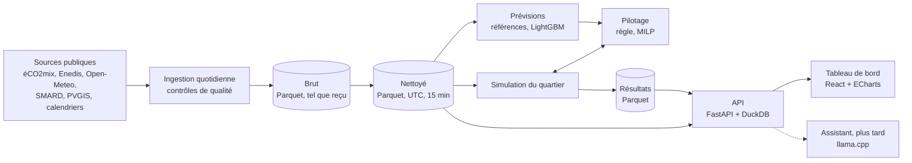

# Ampère : conception

> **Statut** : validée le 23 septembre 2026, à la fin de l'étape 0 ; complétée aux étapes 1 et 2 (ADR 012 à 023).

Ce document décrit ce que le projet doit faire, pour qui, avec quelles contraintes et selon quelle architecture. Chaque décision importante est détaillée dans un ADR (`docs/decisions/`), et chaque notion technique est expliquée dans le [glossaire](glossaire.md).

## Sommaire

1. Le projet en une page
2. Les questions auxquelles le projet répond
3. Objectifs et non-objectifs
4. Contraintes
5. Le quartier modélisé
6. Les sources de données
7. La rigueur : comment éviter de se mentir
8. L'architecture
9. Les risques
10. Les décisions
11. Questions ouvertes

## 1. Le projet en une page

**En une phrase.** Ampère est la copie numérique d'un quartier de 200 maisons près de Lyon, alimentée chaque jour par de vraies données publiques françaises. Elle prévoit la consommation et la production solaire du lendemain, et pilote les batteries des maisons pour réduire la facture et les émissions de CO₂.

**Un jumeau numérique** est un modèle informatique d'un système réel, soumis aux mêmes conditions que lui, qui calcule ce qui s'y passe. On peut y tester des décisions (« et si on pilotait les batteries autrement ? ») sans toucher au monde réel. Notre quartier est fictif, mais tout ce qui l'entoure est réel : la météo de Lyon, les prix du marché de l'électricité, les émissions du réseau et la consommation moyenne des foyers de la région.

**La chaîne complète**

1. **Données** : chaque jour, on récupère les sources publiques, on contrôle leur qualité et on les stocke.
2. **Simulation** : pour chaque maison et à chaque pas de temps, ce qu'elle consomme, produit, stocke, achète et revend.
3. **Prévisions** : la consommation et la production du lendemain, avec leur erreur mesurée.
4. **Décisions** : le pilotage des batteries, par une règle simple puis par optimisation.
5. **Interface** : un tableau de bord pour voir la journée d'hier, comparer les stratégies et jouer des scénarios ; plus tard, un assistant qui répond aux questions sur les données.

**Le message à retenir en 30 secondes** : « J'ai construit la copie numérique d'un quartier de 200 logements, alimentée par de vraies données publiques. Elle prévoit la consommation et la production solaire, et pilote les batteries : X % d'économies et Y % de CO₂ en moins, mesurés sur une période de test. » X et Y seront mesurés, jamais estimés à la main : chaque chiffre publié aura son protocole dans `docs/mesures.md`.

**Pour qui.** Un recruteur doit comprendre le projet en 30 secondes et pouvoir le creuser en 5 minutes : un tableau de bord utilisable sans inscription, un README bilingue, des chiffres reproductibles et des limites affichées.

## 2. Les questions auxquelles le projet répond

Chaque question a une **mesure** chiffrée et une **référence à battre**. Principe : un modèle ou une stratégie ne mérite sa place que s'il fait mieux que la solution la plus simple possible, sur des données qu'il n'a jamais vues.

| | Question | Mesure | Référence à battre | Version |
|---|---|---|---|---|
| Q1 | Combien le quartier consommera-t-il demain, demi-heure par demi-heure ? | Erreur absolue moyenne (MAE), en kW, sur des pas de 30 min | La consommation à la même heure, sept jours plus tôt | v1 |
| Q2 | Quel gain, en euros et en CO₂, apporte un pilotage optimisé des batteries ? | Facture (€) et émissions (kg de CO₂) sur la période de test, par maison et pour le quartier | Pas de batterie ; règle simple | v1 |
| Q3 | Quel est l'effet de la taille des batteries et de la part de toits équipés ? | Facture annuelle du quartier pour chaque scénario | Le scénario de référence | v1 |
| Q4 | Combien les panneaux produiront-ils demain ? | MAE en kW | La production de la veille à la même heure | complète |
| Q5 | Quelle marge d'incertitude autour des prévisions ? | Couverture des intervalles : un intervalle à 80 % doit contenir la réalité 80 % du temps | Des intervalles de largeur fixe | complète |
| Q6 | Combien les erreurs de prévision coûtent-elles au pilotage ? | Écart de gain entre le pilotage sur prévisions et le pilotage en information parfaite | Le pilotage en information parfaite, qui est un plafond | complète |
| Q7 | L'apprentissage par renforcement fait-il mieux que l'optimisation ? | Facture et CO₂ sur la même période de test | MILP et règle simple | complète |
| Q8 | Un petit modèle de langage local répond-il juste aux questions sur les données ? | Taux de bonnes réponses sur un banc d'une centaine de questions ; temps de réponse | La version précédente de l'assistant : chaque changement doit améliorer le score | complète |

- **MAE** : la moyenne des écarts entre prévision et réalité, sans tenir compte du signe. Une MAE de 12 kW signifie que la prévision se trompe en moyenne de 12 kW, vers le haut ou vers le bas.
- **Règle simple** : stocker le surplus solaire dans la batterie, puis le restituer dès que la maison consomme plus qu'elle ne produit.
- **Information parfaite** : l'optimiseur connaît à l'avance la consommation et la production réelles du lendemain. C'est impossible en vrai, donc son gain est un plafond théorique. En v1, le gain de la MILP est calculé ainsi et présenté comme tel ; le gain réaliste, obtenu à partir des prévisions, arrive avec la version complète (Q6).

## 3. Objectifs et non-objectifs

### Première version publiable (v1)

- **Données** : ingestion automatique et quotidienne des sources (RTE éCO2mix, Enedis, Open-Meteo, prix spot publiés par SMARD) sur deux à trois ans d'historique, avec contrôles de qualité.
- **Simulation** : 200 maisons avec panneaux solaires et batteries ; bilan énergétique vérifié à chaque pas de temps.
- **Pilotage** : règle simple contre optimisation MILP sur la journée, avec le prix spot.
- **Prévision** : la consommation du quartier pour le lendemain, comparée à des références naïves en validation glissante.
- **Tableau de bord** (en anglais) : la journée d'hier, la comparaison des stratégies, des scénarios (taille des batteries, part de toits équipés).
- **Publication** : démo en ligne et README bilingue qui présente les résultats chiffrés.

**La v1 est terminée quand** la démo est en ligne, que les données se mettent à jour seules chaque jour, et que le README affiche l'erreur de prévision face à la référence naïve et les gains de la MILP face à la règle simple, tous régénérés par une seule commande.

### Version complète

- Voitures électriques et pompes à chaleur.
- Tarifs comparés : base, heures pleines et heures creuses, Tempo, prix spot.
- Prévision de la production solaire ; prévisions avec leur incertitude (quantiles, intervalles conformes).
- Pilotage sur prévisions en horizon glissant (MPC) ; agent d'apprentissage par renforcement, comparé honnêtement aux autres stratégies.
- Limite de puissance commune au transformateur, qui oblige à coordonner les batteries.
- Suivi des expériences (MLflow) et surveillance de la qualité des données.
- Assistant qui transforme une question en requête SQL, avec son banc d'évaluation.
- Interface bilingue.

### Bonus

Un modèle de substitution (un réseau de neurones qui imite le simulateur, pour explorer les scénarios instantanément) ; un marché local de l'énergie entre voisins ; une API « quand consommer pour émettre le moins de CO₂ ? » ; la détection de dérive des données.

### Non-objectifs

- **Données personnelles** : aucune donnée de compteur individuel, seulement des moyennes publiques.
- **Appareils réels** : le projet ne pilote aucun équipement.
- **Simulation fine du réseau** : pas de calcul des tensions ni des flux dans les câbles ; le transformateur du quartier est une simple limite de puissance.
- **Quartier réel** : le quartier est fictif ; ses paramètres sont réalistes et leurs sources documentées.
- **Battre RTE** : la prévision officielle de RTE peut servir de point de comparaison, pas d'objectif.
- **Conseil** : les chiffres illustrent une méthode ; ce ne sont pas des conseils d'achat ou d'investissement.
- **Temps réel** : le système raisonne par journée et par pas de temps, pas à la seconde.

## 4. Contraintes

| Contrainte | Conséquence pour la conception |
|---|---|
| Budget de 0 € | Outils libres, offres gratuites (GitHub, GHCR) et sources publiques ; aucune API payante. |
| Serveur de démo partagé entre cinq projets : VPS Ubuntu 24.04, 4 processeurs virtuels, 8 Go de mémoire, pas de carte graphique. **Ampère dispose de 2,5 Go**, modèle de langage compris. | Le VPS ne fait que des calculs légers : ingestion, prévision avec un modèle déjà entraîné, optimisation du jour, API. Les entraînements et les gros calculs, lancés depuis la session de développement, tournent hors du traitement quotidien, un à la fois et avec des limites (ADR 013). Le modèle de langage n'est chargé que lorsqu'on l'interroge. |
| Le VPS peut s'arrêter sans prévenir, parfois plusieurs heures (déjà observé). | L'ingestion est idempotente et rattrape les jours manquants au redémarrage ; la surveillance externe est fournie par le socle d'hébergement. |
| Le socle d'hébergement n'a qu'une plateforme de démos minimale (ADR 021 et 022 du socle). | Deux conteneurs dans le Docker rootless de cette plateforme : l'API, que le serveur redéploie lui-même à chaque nouvelle image (ADR 021), et le traitement quotidien, qu'un minuteur du socle lance chaque jour sur la même image (ADR 028). Les données vivent dans un dossier du serveur, en lecture seule pour l'API. |
| Développement sur le VPS, une fois sécurisé (ADR 013) : pas de carte graphique, et une mémoire partagée avec les démos et d'autres services. | Tous les calculs tournent sur le processeur, ce qui suffit pour LightGBM et un petit agent de renforcement ; les réseaux de neurones restent petits. |
| Dépôt public. | Aucun secret versionné. En v1, aucune source ne demande de clé (section 6) ; un `.env.example` reste prévu pour les secrets à venir, qui resteront hors du dépôt. |
| Licences des données. | Chaque source est vérifiée (droit de réutilisation, attribution) avant d'être publiée dans la démo ; les mentions obligatoires apparaissent dans l'interface et le README. |
| Chaque technique doit pouvoir être expliquée et justifiée. | Petits incréments ; chaque notion est définie dans le glossaire ; aucune technique qu'on ne saurait pas justifier face à une référence simple. |
| Temps illimité. | Le vrai risque est de ne jamais finir : la v1 d'abord, avec un périmètre strict, puis les enrichissements. |

## 5. Le quartier modélisé

### 5.1 Le lieu et les maisons *(ADR 002)*

- Un lotissement fictif de **200 maisons individuelles** en périphérie de **Lyon** (région Auvergne-Rhône-Alpes). Point de référence pour la météo et le soleil : 45,76° N ; 4,84° E.
- **Pourquoi Lyon** : des hivers froids et des étés ensoleillés, donc des saisons contrastées ; un ensoleillement moyen, donc des résultats représentatifs de la France.
- **Pourquoi des maisons** : chaque maison a son toit, ce qui donne un sens au scénario « et si 30 % des toits avaient des panneaux ? ». Chaque maison a aussi son compteur et sa facture.

### 5.2 La consommation *(ADR 001)*

**Source.** Enedis publie en open data la consommation réelle des foyers, par demi-heure. Pour chaque région, chaque profil (par exemple le tarif base, ou le tarif heures pleines et heures creuses) et chaque tranche de puissance souscrite, on obtient la courbe moyenne d'un foyer et le nombre de foyers concernés. La puissance souscrite (6 kVA, 9 kVA…) est un bon indice de la taille du logement et de la présence d'un chauffage électrique.

**Construction du quartier.**

1. Chaque maison reçoit un segment (un profil et une tranche de puissance), tiré au sort selon la répartition réelle des foyers de la région.
2. Sa consommation part de la courbe moyenne réelle de son segment.
3. On y ajoute une variabilité propre au foyer : un facteur d'échelle, de petits décalages d'horaires, des pics d'appareils. Une moyenne de milliers de foyers est lisse, alors qu'une vraie maison a des pics (four, lave-linge) qui comptent pour une batterie.
4. Un test vérifie que cette variabilité ne déforme pas le total : la somme des 200 maisons reste proche de 200 fois la courbe réelle.

Le tirage au sort utilise une graine fixe : le même quartier est reconstruit à chaque exécution. La méthode précise et ses paramètres seront fixés à l'étape 3 (simulation).

**Du pas de 30 min au pas de 15 min** *(ADR 005)*. La simulation tourne au pas de 15 min, mais Enedis publie au pas de 30 min. Chaque demi-heure devient donc deux quarts d'heure de même puissance, ce qui conserve exactement l'énergie mesurée ; la variabilité par foyer ajoute ensuite le détail. Les prévisions de consommation sont notées sur des sommes de 30 min, le pas des vraies données, pour ne jamais noter du détail inventé.

**Jours récents.** Enedis publie chaque trimestre, environ un mois après la fin du trimestre. Pour les jours pas encore publiés, dont « hier », le jumeau estime la consommation avec un modèle calé sur l'historique Enedis, à partir de la température observée et du calendrier. Ces jours sont marqués « estimés » dans les données et dans l'interface. Ils ne servent jamais à évaluer les prévisions : les prévisions sont évaluées uniquement sur des données publiées par Enedis.

**Archivage.** Enedis ne garde en ligne qu'une fenêtre glissante, de juillet 2023 à juin 2026 au 23 septembre 2026 : chaque publication est archivée telle quelle dès sa sortie.

**Limite connue.** Les courbes Enedis mélangent maisons et appartements. La tranche de puissance souscrite permet de s'approcher du profil d'une maison, sans le garantir.

### 5.3 Les équipements (v1)

- **Panneaux solaires** sur une partie des toits (paramètre de scénario). Leur taille, leur orientation et leur inclinaison varient d'une maison à l'autre.
- **Batteries** dans une partie des maisons équipées de panneaux (paramètre de scénario). Chacune est définie par sa capacité (kWh), sa puissance maximale (kW) et son rendement, c'est-à-dire la part de l'énergie stockée que l'on récupère.
- Les valeurs par défaut (part des toits équipés, tailles typiques) seront fixées et sourcées à l'étape 3.
- Les voitures électriques et les pompes à chaleur arrivent avec la version complète.

> **kW ou kWh ?** Le kW mesure une puissance, c'est-à-dire un débit ; le kWh mesure une énergie, c'est-à-dire une quantité. Une batterie de 10 kWh qui débite 5 kW se vide en 2 heures. La puissance d'un panneau s'exprime en kWc (kilowatt-crête) : ce qu'il produit en plein soleil, dans des conditions standard.

### 5.4 La production solaire *(ADR 006)*

- **Méthode** : calculer la production de chaque toit à partir de l'ensoleillement observé à Lyon (données Open-Meteo) et des caractéristiques du toit, avec pvlib, la bibliothèque Python de référence pour ce calcul.
- **PVGIS**, l'outil solaire de la Commission européenne, ne couvre que les années 2005 à 2023 : il ne peut pas fournir les jours récents. Il servira à caler le calcul, en comparant les productions annuelles.
- **Validation** : Enedis publie aussi la production réelle des petites installations solaires de la région, par demi-heure. On comparera notre calcul à ces courbes, ramenées à 1 kWc.

### 5.5 Le prix et la facture *(ADR 003)*

**Le prix spot.** Chaque jour vers 13 h, le marché européen de l'électricité fixe le prix de chaque quart d'heure du lendemain (de chaque heure avant le 1er octobre 2025). Ce prix varie beaucoup : il est bas la nuit et au milieu des journées ensoleillées, parfois négatif, et élevé les soirs d'hiver. ENTSO-E, l'association des gestionnaires de réseaux européens, le publie, mais pas sous licence libre ; SMARD, la plateforme du régulateur allemand de l'énergie, le republie sous licence CC BY 4.0 et sera notre source (section 6).

**La facture d'une maison**, à chaque pas de temps :

- **achat** : énergie achetée × (prix spot + composantes fixes par kWh : acheminement, taxes, marge du fournisseur), TVA comprise ;
- **revente** : le surplus solaire est revendu à un tarif d'achat fixe, comme le prévoit l'obligation d'achat pour les petites installations ;
- **abonnement** : identique quelle que soit la stratégie ; il est affiché, mais ne change aucune comparaison.

Les montants (acheminement, taxes, tarif d'achat) viendront de sources officielles, notamment la Commission de régulation de l'énergie (CRE), et seront documentés.

**Pourquoi le prix spot en v1.** Avec un prix fixe, un kWh stocké vaut la même chose quelle que soit l'heure où on le restitue. Le seul gain possible est alors de stocker le surplus solaire au lieu de le revendre bon marché, et la règle simple le fait déjà : l'optimisation n'aurait presque rien à montrer. Avec un prix qui varie, on peut aussi acheter quand c'est bon marché et puiser dans la batterie quand c'est cher : planifier devient utile.

**Limite connue.** Les offres indexées sur le prix spot restent rares chez les ménages français. La version complète comparera les tarifs les plus courants : base, heures pleines et heures creuses, Tempo.

### 5.6 Les émissions de CO₂

- Les émissions d'une maison sont égales à l'énergie achetée au réseau multipliée par l'intensité carbone du réseau au même moment.
- L'**intensité carbone** (en grammes de CO₂ par kWh) est publiée par RTE dans éCO2mix, tous les quarts d'heure. Elle est basse quand le nucléaire, l'hydraulique, l'éolien et le solaire suffisent, et monte quand les centrales au gaz tournent.
- **Limite 1 : intensité moyenne ou marginale.** RTE publie une intensité *moyenne* : les émissions de toute la production divisées par l'énergie produite. Or l'effet réel d'un kWh consommé en plus dépend de l'intensité *marginale*, celle de la centrale qu'on allume pour le produire, souvent au gaz. Elle n'est pas publiée. Nos chiffres de CO₂ sont donc des estimations, présentées comme telles.
- **Limite 2 : l'intensité du lendemain n'est pas publiée à l'avance.** éCO2mix publie une prévision de consommation, mais aucune prévision de l'intensité carbone. En v1, le pilotage minimise donc la facture seule, et le CO₂ est mesuré après coup avec l'intensité réelle (ADR 008).
- **Limite 3 : les importations ne sont pas comptées.** D'après sa description, l'intensité publiée estime les émissions de la production française seule.
- **Convention** (ADR 008) : l'énergie solaire revendue n'est pas comptée comme des émissions évitées. C'est un choix prudent, qui ne gonfle pas les gains.

### 5.7 Le pilotage des batteries *(ADR 004)*

- Chaque batterie appartient à sa maison, mais toutes sont pilotées par un **agrégateur**, un acteur central qui décide pour l'ensemble : c'est le métier des « centrales électriques virtuelles ».
- En v1, chaque maison est optimisée séparément : ce sont 200 petits problèmes indépendants, rapides à résoudre. On mesure en plus la puissance totale du quartier au transformateur, pour repérer l'**effet rebond** : si toutes les batteries chargent au même moment, quand le prix est bas, elles créent un nouveau pic.
- Stratégies comparées en v1 :
  1. **sans batterie** (référence) ;
  2. **règle simple** : stocker le surplus solaire, puis le restituer dès que la maison consomme plus qu'elle ne produit ;
  3. **MILP** sur la journée, en information parfaite.
- La version complète ajoute le pilotage sur prévisions (MPC), l'apprentissage par renforcement et une limite de puissance commune au transformateur.

> **MILP** (optimisation linéaire en nombres entiers) : on décrit le problème par des équations (le bilan de chaque pas de temps, les limites de la batterie) et par un objectif (la facture la plus basse). Un programme appelé solveur trouve le plan de charge et de décharge qui atteint cet objectif. « En nombres entiers » signifie que certaines variables ne valent que 0 ou 1, par exemple pour interdire de charger et de décharger en même temps.

### 5.8 Le bilan énergétique

À chaque pas de temps et pour chaque maison, l'énergie qui entre est égale à l'énergie qui sort :

```text
production solaire + décharge + achat = consommation + charge + revente
```

La batterie suit sa propre équation, avec des pertes à la charge et à la décharge :

```text
stock en fin de pas = stock en début de pas
                      + charge × rendement de charge
                      − décharge ÷ rendement de décharge
0 ≤ stock ≤ capacité
```

Deux règles s'ajoutent :

- une maison n'achète et ne revend jamais au même instant, car elle n'a qu'un compteur ;
- l'énergie revendue ne peut pas dépasser la production solaire du moment : la batterie alimente la maison, pas le réseau.

Ces égalités sont vérifiées automatiquement à chaque pas de temps, pour chaque maison et pour le quartier.

### 5.9 Les indicateurs

Pour chaque maison et pour le quartier :

- la **facture** (€) et les **émissions** (kg de CO₂) ;
- le **taux d'autoconsommation** : la part de la production solaire consommée sur place, directement ou via la batterie ;
- le **taux d'autosuffisance** : la part de la consommation couverte par le solaire local ;
- le **pic de puissance** au transformateur, pour le quartier.

## 6. Les sources de données

Chaque source a été vérifiée le 23 septembre 2026, dans sa documentation officielle et par un appel à son API. Tous les accès sont gratuits et, en v1, **aucun ne demande de clé**.

### 6.1 Vue d'ensemble

| Source | Ce qu'on y prend | Pas de temps | Historique | Fraîcheur | Licence |
|---|---|---|---|---|---|
| RTE éCO2mix | Intensité CO₂ nationale ; production solaire régionale et son taux de charge ; consommation nationale et prévision de RTE | 15 min (temps réel), 30 min (consolidé) | depuis 2012 | toutes les 15 min (national), toutes les heures (régional) | Licence Ouverte 2.0 |
| Enedis, consommation | Courbe moyenne des foyers par profil et tranche de puissance | 30 min | juillet 2023 à juin 2026 | chaque trimestre | Licence Ouverte 2.0 |
| Enedis, production | Production des petites installations solaires de la région | 30 min | juillet 2023 à juin 2026 | chaque trimestre | Licence Ouverte 2.0 |
| Open-Meteo | Météo observée ; prévisions telles qu'émises ; prévision du lendemain | 1 h | depuis 1940 (observé), 2024 (prévisions archivées) | de 0 à 5 jours de délai selon le modèle | CC BY 4.0, usage non commercial |
| PVGIS | Production solaire typique d'un toit, pour caler notre calcul | 1 h | 2005 à 2023 | aucune (archive) | Réutilisation libre en citant la source |
| SMARD | Prix spot de la zone France | 15 min (1 h avant octobre 2025) | depuis 2015 | quotidienne | CC BY 4.0 |
| Calendriers officiels | Jours fériés, vacances scolaires | jour | plusieurs années | annuelle | Licence Ouverte |
| Textes officiels | Acheminement, taxes, tarif d'achat | — | — | à chaque évolution | Informations publiques |

### 6.2 Fiches

#### RTE éCO2mix *(ADR 024)*

- **Contenu** : le bilan électrique de la France (consommation, production par filière, échanges, intensité CO₂) et celui de chaque région (consommation, production par filière, taux de charge du solaire).
- **Accès** : plateforme [ODRÉ](https://odre.opendatasoft.com/explore/dataset/eco2mix-national-tr/), API sans clé. Un quota de 50 000 appels par mois et par utilisateur a été instauré contre les robots trop gourmands ; un appel par jour et par jeu de données nous suffit.
- **Trois versions d'une même donnée** : temps réel (publiée en continu), consolidée (vérifiée, vers le milieu du mois suivant), définitive (au second semestre de l'année suivante). Les valeurs changent d'une version à l'autre : on garde chaque version reçue, avec sa date de réception.
- **Usage dans Ampère** :
  - l'intensité CO₂ nationale (champ `taux_co2`) ;
  - le taux de charge du solaire en Auvergne-Rhône-Alpes (champ `tch_solaire`), pour valider notre calcul solaire ;
  - la consommation nationale et la prévision J-1 de RTE, pour un banc d'essai facultatif de notre méthode de prévision.
- **Pièges** : les champs date et heure locaux subissent les changements d'heure, alors que le champ `date_heure` est en UTC. ODRÉ range ses lignes en heures de Paris : il donne au printemps l'heure qui n'existe pas, aux instants de la suivante, et à l'automne un seul des deux passages de l'heure vécue deux fois (ADR 024). En consolidé et en définitif, les mesures nationales ne sont remplies qu'à la demi-heure, sur des lignes au quart d'heure. L'intensité CO₂ ne compte pas les importations (section 5.6).
- **Licence** : Licence Ouverte 2.0, source à citer : « RTE, éCO2mix ».

#### Enedis, consommation des foyers *(ADR 001 et 026)*

- **Contenu** ([conso-inf36-region](https://opendata.enedis.fr/datasets/conso-inf36-region/)) : pour chaque demi-heure, chaque région, chaque profil et chaque tranche de puissance souscrite, le nombre de foyers, l'énergie totale consommée et la courbe moyenne d'un foyer.
- **En Auvergne-Rhône-Alpes** : 82 segments. Les profils résidentiels sont RES1, RES11, RES2, RES2WE, RES3 et RES4 ; leur sens exact sera documenté à l'étape 2. Les tranches vont de 0-3 kVA à 30-36 kVA, certaines regroupées.
- **Historique et rythme** : de juillet 2023 à juin 2026, en fenêtre glissante, soit environ 4,3 millions de lignes pour la région. La dernière publication date du 30 juillet 2026 ; la suivante est attendue fin octobre 2026.
- **Accès** : API sans clé. Le portail a changé de plateforme : l'ancienne API, compatible avec celle d'ODRÉ, survit pour les lignes et les exports, Parquet compris, et l'API native donne les métadonnées, dont la date de la dernière publication (ADR 026).
- **Champs** : le nombre de sites, l'énergie totale, modélisée pour les sites sans courbe relevée, et trois courbes moyennes des sites à compteur communicant. Les courbes n° 1 et n° 2 partagent ces sites en deux moitiés selon la part de leur consommation entre 8 h et 20 h ; la courbe n° 1 + n° 2, la courbe globale, les réunit. L'indice de représentativité est la part des sites du segment qu'une courbe représente.
- **Pièges** :
  - les valeurs sont des Wh par demi-heure : il faut les multiplier par 2 pour obtenir une puissance moyenne en W ;
  - le secret statistique : sous 5 000 sites relevés, une courbe n'est publiée à la demi-heure que la semaine ou le jour du pic du mois, et vaut le reste du temps la moyenne de sa journée, recopiée sur 48 demi-heures ; sous 100, elle est masquée. En janvier 2026, 18 segments résidentiels sur 39 sont concernés ;
  - les courbes mélangent maisons et appartements.
- **Licence** : Licence Ouverte 2.0, source à citer : « Enedis, open data ».

#### Enedis, production solaire *(ADR 026)*

- **Contenu** ([prod-region](https://opendata.enedis.fr/datasets/prod-region)) : même structure pour l'électricité injectée sur le réseau, par filière (dont « Solaire ») et par tranche de puissance. Les tranches 0-3 kW et 3-9 kW correspondent aux toits de maisons.
- **Historique, rythme et licence** : les mêmes que pour la consommation.
- **Usage** : second point de comparaison pour valider notre calcul solaire.
- **Piège** : beaucoup de petites installations ne vendent que leur surplus. Leur injection est donc la production moins ce que la maison consomme, ce qui déforme la courbe.

#### Open-Meteo *(ADR 025)*

- **Contenu** : une API météo unique qui donne accès à trois types de données.
  - **Météo observée** : la *réanalyse* ERA5 (mailles d'environ 25 km, depuis 1940, 5 jours de délai), et une série qu'Open-Meteo assemble à partir des runs du modèle ECMWF IFS (9 km, depuis 2017, sans délai), celle qu'Ampère utilise ([documentation](https://open-meteo.com/en/docs/historical-weather-api)).
  - **Prévisions telles qu'elles ont été émises** : l'API [Previous Runs](https://open-meteo.com/en/docs/previous-runs-api) donne les valeurs prévues 1 à 7 jours avant, archivées depuis janvier 2024 pour la plupart des modèles. L'API [Single Runs](https://open-meteo.com/en/docs/single-runs-api) donne un *run* complet, identifié par son heure de lancement ; celui d'ECMWF IFS est archivé depuis mars 2024.
  - **Prévision du lendemain**, pour le fonctionnement quotidien.
- **Variables utiles** : température à 2 m ; rayonnement global, direct, diffus et direct normal ; vent à 10 m. Toutes sont au pas horaire. Le rayonnement sur plan incliné, qu'Open-Meteo calcule pour une seule orientation à la fois, vient de pvlib, toit par toit.
- **Usage** : entrée du calcul solaire, variables de la prévision de consommation, estimation des jours récents.
- **Piège majeur, la fuite d'information** : une prévision émise la veille à midi ne doit utiliser que des runs lancés avant midi la veille. Or `previous_day1` donne la valeur prévue 24 h avant l'heure visée : pour l'après-midi du lendemain, elle vient d'un run lancé *après* midi la veille. Il faut donc un run précis (Single Runs), ou des prévisions à 48 h. Ce choix sera tranché dans l'ADR 007.
- **Pièges de format** : un rayonnement est la moyenne de l'heure qui finit à l'instant donné, alors que la température et le vent sont des valeurs à l'instant ; l'archive complète le jour en cours avec la prévision ; le champ `generationtime_ms` change à chaque appel, même quand les données ne changent pas.
- **Trous** : six runs de 0 h UTC manquent, en entier ou en partie, du 5 au 9 août 2025 et le 23 juin 2026. Les prévisions des jours suivants, tous dans la période de test, n'ont pas leur run entier (ADR 025).
- **Licence** : CC BY 4.0, source à citer : « Weather data by Open-Meteo.com ». L'API gratuite est réservée à l'usage non commercial, à moins de 10 000 appels par jour ([conditions](https://open-meteo.com/en/terms)). Une démo de portfolio sans publicité ni abonnement entre dans ce cadre.

#### PVGIS

- **Contenu** : l'outil solaire de la Commission européenne (JRC). Il calcule la production horaire d'un toit donné (orientation, inclinaison, puissance) et fournit une année météo type.
- **Historique** : de 2005 à 2023 (base satellitaire SARAH-3). Il ne couvre pas les jours récents.
- **Accès** : [API](https://joint-research-centre.ec.europa.eu/photovoltaic-geographical-information-system-pvgis/getting-started-pvgis/api-non-interactive-service_en) sans clé, limitée à 30 appels par seconde ; formats JSON ou CSV.
- **Usage** : caler notre calcul solaire, en comparant les productions mensuelles et annuelles typiques à Lyon.
- **Licence** : réutilisation autorisée en citant la source, selon la [politique de la Commission](https://joint-research-centre.ec.europa.eu/photovoltaic-geographical-information-system-pvgis/general-information/usage-conditions-data-protection_en). Source à citer : « PVGIS, Commission européenne (JRC) ».

#### SMARD, prix spot *(ADR 003 et 023)*

- **Contenu** : le prix du marché de la veille pour la zone France (filtre `254`, « Marktpreis: Frankreich »). SMARD le reprend d'ENTSO-E ; c'est la plateforme de la Bundesnetzagentur, le régulateur allemand de l'énergie.
- **Pas de temps et historique** : quart d'heure depuis le 1er octobre 2025, heure auparavant ; depuis 2015, en fichiers hebdomadaires. La semaine en cours est disponible.
- **Accès** : API JSON sans clé, décrite par une [documentation communautaire](https://github.com/bundesAPI/smard-api).
- **Pièges** : l'API n'a pas de documentation officielle, donc le schéma sera contrôlé à chaque ingestion. Les prix sont en €/MWh : il faut diviser par 1 000 pour obtenir des €/kWh.
- **Licence** : CC BY 4.0, source à citer : « Bundesnetzagentur | SMARD.de » ([conditions](https://www.smard.de/home/datennutzung)).
- **Pourquoi pas ENTSO-E directement** : les prix spot ne figurent pas dans la [liste des données librement réutilisables](https://transparencyplatform.zendesk.com/hc/en-us/articles/40921911218961-Legal-Terms-and-Conditions) d'ENTSO-E. Selon ses conditions d'utilisation, les republier demanderait l'accord de leur producteur, la bourse EPEX SPOT.
- **Recoupement possible** : [Ember](https://ember-energy.org/data/european-wholesale-electricity-price-data/) publie aussi ces prix, au pas horaire et sous CC BY 4.0, mis à jour chaque mois. On pourra s'en servir pour contrôler la cohérence de l'historique.

#### Calendriers officiels *(ADR 027)*

- **Jours fériés** : [API d'Etalab](https://www.data.gouv.fr/dataservices/jours-feries), Licence Ouverte : les jours fériés de métropole de 2006 à 2031, en un fichier JSON de 8 Ko.
- **Vacances scolaires** : [calendrier de l'Éducation nationale](https://www.data.gouv.fr/datasets/le-calendrier-scolaire), Licence Ouverte 2.0, exporté en Parquet depuis data.education.gouv.fr. Lyon est en zone A, dont les huit académies ont les mêmes vacances.
- **Pièges** : une période va de son premier jour sans cours au jour de la reprise, exclu, sauf une période d'un seul jour, dont le début et la fin sont égaux ; l'été a une ligne pour les élèves et une pour les enseignants, qui reprennent un jour plus tôt.
- **Usage** : variables de la prévision, car un jour férié ou une période de vacances change la consommation.

#### Textes officiels pour la facture

- **Sources** : les délibérations de la CRE pour l'acheminement (TURPE) et le tarif d'achat du surplus ; les textes fiscaux pour l'accise sur l'électricité et la TVA.
- **Usage** : les composantes fixes de la facture (section 5.5). Les valeurs seront relevées et datées à l'étape 4.

#### Plus tard : le calendrier Tempo

- **Accès** : API RTE [« Tempo Like Supply Contract »](https://data.rte-france.com/catalog/-/api/user_guide/236629), avec compte RTE et authentification OAuth, soumise aux [conditions générales](https://data.rte-france.com/cgu) de RTE. Ces conditions seront vérifiées au moment de la version complète.

### 6.3 Conséquences pour la conception

- **Aucun secret en v1** : aucune source ne demande de clé.
- **Données révisées** : éCO2mix passe du temps réel au consolidé, puis au définitif. On stocke chaque version reçue avec sa date de réception, et on sait toujours quelle version a servi à quel calcul.
- **Pas de temps** : Enedis est au pas de 30 min ; éCO2mix au pas de 15 min en temps réel et de 30 min en consolidé ; SMARD au quart d'heure depuis octobre 2025 ; Open-Meteo au pas horaire. Les vraies courbes de consommation ne descendent pas sous 30 min. La simulation tourne pourtant au pas de 15 min, celui du marché : la consommation y est découpée à énergie constante, et les prévisions sont notées à 30 min (ADR 005).
- **Périodes utilisables** : la consommation réelle couvre juillet 2023 à juin 2026, et les prévisions météo archivées commencent en 2024. L'évaluation honnête des prévisions commence donc en 2024 (ADR 007).
- **Attributions** : chaque source est citée dans l'interface et dans le README, avec la formule demandée.
- **Quotas** : un appel par jour et par source suffit ; l'ingestion reste loin de toutes les limites.

## 7. La rigueur : comment éviter de se mentir

### 7.1 Le découpage du temps *(ADR 007)*

| Période | Dates (heure de Paris) | Rôle |
|---|---|---|
| Historique de calage | juillet 2023 à mi-mars 2024 | Construire le quartier et calculer les variables « même heure la semaine précédente » ; pas d'évaluation, faute de prévisions météo archivées |
| Mise au point | 15 mars 2024 au 30 juin 2025 | Choisir les variables et les réglages des modèles, comparer les stratégies, en validation glissante |
| Test | 1er juillet 2025 au 30 juin 2026 | Juger une seule fois, à la fin : toutes les saisons, jamais regardées pendant la mise au point |

- **Évaluation finale** : validation glissante mois par mois sur la période de test. Au début de chaque mois, le modèle est réentraîné avec toutes les données antérieures, puis il prévoit ce mois jour après jour.
- **Garde-fou** : le code refuse de lire la période de test hors de l'évaluation finale, qui doit être demandée explicitement.
- **Publication** : les résultats du test sont publiés tels quels, même décevants.

### 7.2 Une prévision émise comme en vrai

- La prévision du lendemain (de 0 h à 24 h) est **émise la veille à 11 h**. Un agrégateur doit en effet connaître ses besoins avant la clôture du marché de la veille, à midi.
- Elle n'utilise que ce qui était connu à 11 h :
  - la prévision météo du *run* ECMWF IFS lancé à 0 h UTC la veille, qui est disponible dans la matinée ;
  - la consommation jusqu'à l'avant-veille, puisque les compteurs communicants sont relevés le lendemain ;
  - le calendrier : jours fériés et vacances scolaires.
- La prévision est évaluée sur la consommation réelle publiée par Enedis, au pas de 30 min. Les jours « estimés » n'entrent jamais dans une évaluation.

### 7.3 Références et mesures

- **Chaque modèle doit battre le précédent** pour mériter sa place : référence naïve, puis LightGBM, puis éventuellement un réseau de neurones.
- **Références naïves** : la consommation à la même heure sept jours plus tôt, et la moyenne des quatre mêmes jours de la semaine précédents.
- **Mesures** :
  - la MAE, en kW, sur des pas de 30 min ;
  - le *score de compétence* : la part de l'erreur de la référence naïve que le modèle élimine (1 − MAE du modèle ÷ MAE de la référence) ;
  - des résultats détaillés par saison et par heure, car les erreurs ne sont pas uniformes.
- **Pas de MAPE** (voir le glossaire). Plus tard, pour les prévisions avec incertitude, on ajoutera l'erreur de quantile et la couverture des intervalles.

### 7.4 L'évaluation du pilotage

- **Stratégies comparées sur la période de test** : sans batterie, règle simple, et MILP en information parfaite, présentée comme un plafond.
- **Mesures** : facture annuelle (€), émissions (kg de CO₂), taux d'autoconsommation et d'autosuffisance, pic au transformateur ; par maison et pour le quartier.
- **Objectif du pilotage** : la facture seule (ADR 008). Le CO₂ est mesuré après coup, avec l'intensité réelle.
- **Plus tard** : le pilotage sur prévisions (MPC) mesurera ce que coûtent les erreurs de prévision, par comparaison avec ce plafond.

### 7.5 Le temps et les données révisées

- **UTC partout** : toutes les dates sont stockées en UTC et converties en heure de Paris seulement à l'affichage.
- **Journées de 23 et 25 heures** : une journée locale compte alors 92 ou 100 quarts d'heure au lieu de 96. Des tests couvrent ces cas.
- **Données révisées** : chaque version reçue est conservée avec sa date de réception, et chaque calcul indique quelle version il a utilisée.
- **Contrôles de qualité** à l'ingestion :
  - schéma (colonnes, types) ;
  - trous et doublons ;
  - valeurs plausibles ;
  - continuité des horodatages.
  
  Un contrôle en échec déclenche une alerte : aucun trou n'est comblé en silence, et les règles de comblement sont documentées.

### 7.6 La reproductibilité

- **Une seule commande** régénère tous les chiffres du README à partir des données brutes archivées.
- **Graines aléatoires fixées** pour la construction du quartier et pour les modèles.
- **Versions figées** : les dépendances sont verrouillées (`uv.lock`) et chaque jeu de données est identifié par sa date de réception.
- **`docs/mesures.md`** : chaque chiffre publié, avec son protocole, sa commande et les versions des données.
- **Tests de non-régression** : des résultats de référence sont conservés, et la CI signale tout changement inattendu.

## 8. L'architecture

### 8.1 Vue d'ensemble



Tout le traitement des données est écrit en Python ; le tableau de bord, en TypeScript.

### 8.2 Qui tourne où

| Lieu | Rôle |
|---|---|
| VPS, session de développement (ADR 013) | Développement, entraînements, mise au point, évaluation finale sur la période de test, précalcul des scénarios, notebooks |
| GitHub Actions | CI sur chaque pull request et chaque push vers `main` (formatage, analyse statique, types, tests, build ; ADR 019), construction des images Docker publiées sur GHCR (ADR 020) |
| VPS | Traitement quotidien (ADR 011), API, qui sert aussi les fichiers du tableau de bord (ADR 018) ; plus tard, l'assistant chargé à la demande. Le serveur déploie lui-même chaque nouvelle image de `main` (ADR 021) |

Les modèles entraînés sont livrés au traitement quotidien sous forme de fichiers versionnés. Le mode de livraison sera choisi à l'étape 5.

### 8.3 Le traitement quotidien *(ADR 011 et 028)*

Un minuteur systemd lance chaque jour à **14 h (heure de Paris)** un conteneur qui exécute, dans l'ordre :

1. **Ingestion** des données de la veille et des prix du lendemain, publiés vers 13 h, avec rattrapage des jours manquants.
2. **Contrôles de qualité.**
3. **Simulation de la veille** pour chaque stratégie : règle simple et MILP en information parfaite.
4. **Prévision de la consommation du lendemain.** Elle est calculée à 14 h, mais n'utilise que l'information disponible à 11 h (section 7.2).
5. **Plus tard, le plan des batteries pour le lendemain**, calculé à partir des prévisions et des prix (MPC).
6. **Export des résultats** pour l'API. Le premier, depuis le 28 septembre 2026, est celui de l'écran « Data » : les derniers jours de chaque série, dans `exports/recent.json` (ADR 029).

Le traitement est idempotent : le relancer ne change rien. L'option `Persistent` du minuteur relance une exécution manquée dès le redémarrage du serveur. Depuis le 28 septembre 2026, ce minuteur est `demo-daily@ampere.timer`, dans la plateforme des démos du socle : il lance le service `daily` de `deploy/compose.yaml` sur l'image que la démo sert, et chaque source y tourne dans un processus à part (ADR 028). L'ingestion est la seule étape écrite à ce jour. Chaque trimestre, la publication Enedis transforme les jours « estimés » en jours réels, et les jours concernés sont recalculés.

### 8.4 Les données *(ADR 022)*

- **Trois couches** :
  - **brut**, tel que reçu, jamais modifié, avec la date de réception ;
  - **nettoyé**, validé, en UTC, au pas de 15 min, avec des unités harmonisées ; la météo reste au pas horaire et les courbes d'Enedis à la demi-heure, comme publiées, et les calendriers ont une ligne par jour de Paris (ADR 025, 026 et 027) ;
  - **résultats** : simulations, prévisions, indicateurs.
- **Stockage** : fichiers Parquet, interrogés en SQL avec DuckDB (par l'API, et plus tard par l'assistant).
- **Volume** : environ 200 maisons × 96 pas × 365 jours × 3 ans, soit une vingtaine de millions de lignes par grandeur simulée. On attend de l'ordre du gigaoctet ; la mesure réelle sera faite à l'étape 3.

### 8.5 Le budget mémoire sur le VPS (2,5 Go)

| Composant | Mémoire visée | Présence |
|---|---|---|
| API (FastAPI + DuckDB) | 400 Mo au plus | permanente |
| Tableau de bord | quasi nulle | fichiers statiques servis par l'API (ADR 018) |
| Traitement quotidien | 1 Go au plus | quelques minutes par jour |
| Assistant (plus tard) | 2 Go au plus | à la demande, jamais pendant le traitement quotidien |

Chaque conteneur a une limite de mémoire. Les consommations réelles seront mesurées et reportées dans `docs/mesures.md`. Tant que le développement se fait sur le VPS (ADR 013), la session de développement consomme aussi de la mémoire : ses calculs lourds ne tournent jamais en même temps que le traitement quotidien.

### 8.6 Organisation du dépôt (proposition, à confirmer à l'étape 1)

```text
ampere/
├── src/ampere/      # paquet Python : ingestion, simulation, prévisions, pilotage, API
├── web/             # tableau de bord React + TypeScript
├── tests/           # tests Python
├── notebooks/       # analyses qui racontent les résultats
├── deploy/          # Dockerfile, Compose et leurs essais ; le minuteur est dans le socle
├── docs/            # conception, décisions, mesures, glossaire
├── pyproject.toml   # projet Python (uv)
└── uv.lock          # versions exactes des dépendances
```

## 9. Les risques

| Risque | Effet | Parade |
|---|---|---|
| Ne jamais finir (risque principal) | Aucune version publiée | Périmètre de la v1 strict ; livraisons courtes ; tout ajout hors v1 est reporté à la version complète |
| Une source change ou disparaît (API SMARD non officielle, format Enedis, quotas) | Ingestion cassée | Contrôles de schéma ; données brutes archivées ; source de secours pour les prix (Ember) ; alerte |
| Retard de publication d'Enedis | Pas de consommation réelle récente | Jours estimés et marqués comme tels ; évaluation uniquement sur les données publiées |
| Fuite d'information | Scores trop beaux | Protocole de la section 7 ; garde-fou sur la période de test ; tests qui vérifient qu'aucune donnée postérieure à l'émission n'est utilisée |
| Quatre domaines techniques à maîtriser (prévision, optimisation, marché de l'électricité, renforcement) | Décisions mal justifiées, retard | Petits incréments ; références simples d'abord ; glossaire tenu à jour |
| Mémoire du VPS | Démo arrêtée faute de mémoire | Budget de la section 8.5 ; limites par conteneur ; mesures réelles |
| Arrêts du VPS | Trous dans les données | Minuteur avec rattrapage ; ingestion idempotente ; surveillance externe fournie par le socle |
| Résultats décevants (batterie peu rentable, modèle à peine meilleur que la référence) | Message moins flatteur | Publier tel quel et l'expliquer : un résultat négatif honnête reste un résultat |
| Licences | Données à retirer, litige | Sources vérifiées (section 6) ; mentions affichées ; aucune republication de données non libres |
| Changements d'heure et fuseaux | Décalages silencieux | UTC partout ; tests des journées de 23 et de 25 heures |
| Détail inventé en passant de 30 à 15 min | Scores trompeurs | Découpage à énergie constante ; notation à 30 min (ADR 005) |
| Développement et démos sur le même serveur | Mémoire saturée, service arrêté ; code exposé | Sécurisation préalable du VPS (ADR 013) ; swap ; limites par conteneur ; un calcul lourd à la fois ; code poussé régulièrement sur GitHub |

## 10. Les décisions

Chaque ADR présente le contexte, les options envisagées avec leurs avantages et leurs inconvénients, la décision et ses conséquences.

| N° | Décision | Statut |
|---|---|---|
| [001](decisions/001-consommation-enedis.md) | La consommation des maisons vient des courbes réelles d'Enedis | Acceptée |
| [002](decisions/002-lieu-lyon.md) | Un lotissement de 200 maisons près de Lyon | Acceptée |
| [003](decisions/003-tarif-prix-spot-smard.md) | Tarif v1 au prix spot, publié par SMARD | Acceptée |
| [004](decisions/004-batteries-pilotage-central.md) | Batteries individuelles, pilotage central | Acceptée |
| [005](decisions/005-pas-de-temps-15-min.md) | Pas de temps de 15 min, prévisions notées à 30 min | Acceptée |
| [006](decisions/006-production-solaire-pvlib.md) | Production solaire calculée avec pvlib et la météo | Acceptée |
| [007](decisions/007-periodes-et-protocole-de-test.md) | Un an de test, jamais vu pendant la mise au point | Acceptée |
| [008](decisions/008-objectif-du-pilotage.md) | Le pilotage minimise la facture ; le CO₂ est mesuré | Acceptée |
| [009](decisions/009-projet-python-uv.md) | Projet Python géré avec uv | Acceptée |
| [010](decisions/010-tableau-de-bord-react-echarts.md) | Tableau de bord en React et ECharts | Acceptée |
| [011](decisions/011-traitement-quotidien-minuteur.md) | Traitement quotidien lancé par un minuteur systemd sur le VPS | Acceptée |
| [012](decisions/012-environnement-windows-docker-en-ci.md) | Développement sous Windows, Docker en CI | Remplacée par 013 |
| [013](decisions/013-developpement-sur-le-vps.md) | Développement sur le VPS, une fois sécurisé | Acceptée |
| [014](decisions/014-environnement-de-developpement-sur-le-vps.md) | Environnement de développement : uv, fnm et Docker rootless dans le compte de développement | Acceptée |
| [015](decisions/015-outils-du-tableau-de-bord.md) | Outils du tableau de bord : npm, ESLint et Prettier, Vitest et Testing Library | Acceptée |
| [016](decisions/016-acces-du-tableau-de-bord-a-l-api.md) | Le tableau de bord appelle l'API sous `/api`, sur la même origine | En partie remplacée par 018 |
| [017](decisions/017-styles-du-tableau-de-bord-css-modules.md) | Styles du tableau de bord en CSS Modules | Acceptée |
| [018](decisions/018-routes-de-l-api-sous-api.md) | L'API sert ses routes sous `/api` et, en ligne, les fichiers du tableau de bord | Acceptée |
| [019](decisions/019-integration-continue.md) | Intégration continue : un workflow et deux jobs, versions fixées dans le dépôt | Acceptée |
| [020](decisions/020-image-docker-sur-ghcr.md) | Image Docker de la démo, construite par la CI et publiée sur GHCR | Acceptée |
| [021](decisions/021-demo-en-ligne.md) | Démo en ligne, déployée par la plateforme du socle | Acceptée |
| [022](decisions/022-fondations-des-donnees.md) | Fondations des données : Polars, httpx2, et une couche brute faite des octets reçus | Acceptée |
| [023](decisions/023-ingestion-des-prix-smard.md) | Ingestion des prix spot de SMARD | Acceptée |
| [024](decisions/024-ingestion-d-eco2mix.md) | Ingestion d'éCO2mix, de RTE | Acceptée |
| [025](decisions/025-ingestion-de-la-meteo.md) | Ingestion de la météo d'Open-Meteo | Acceptée |
| [026](decisions/026-ingestion-d-enedis.md) | Ingestion des courbes d'Enedis | Acceptée |
| [027](decisions/027-ingestion-des-calendriers.md) | Ingestion des calendriers | Acceptée |
| [028](decisions/028-traitement-quotidien-en-ligne.md) | Le traitement quotidien en ligne | Acceptée |
| [029](decisions/029-ecran-data.md) | L'écran « Data » : export quotidien, API et graphiques empilés | Acceptée |
| [030](decisions/030-notebook-d-exploration.md) | Le notebook d'exploration : Jupyter, et un garde-fou pour la période de test | Acceptée |

**Décisions mineures, sans ADR** : interface de la v1 en anglais, avec des textes regroupés pour ajouter le français sans réécriture ; licence MIT ; brief et prompts de travail conservés en local, hors du dépôt public.

**Décisions à venir**
- Étape 4 : le solveur (HiGHS ou OR-Tools).
- Étape 5 : le modèle de prévision retenu, et le mode de livraison des modèles au VPS.
- Version complète : le modèle de langage (taille et licence), le renforcement, le suivi des expériences.

## 11. Questions ouvertes

| Question | Quand |
|---|---|
| Sens exact des profils résidentiels d'Enedis | Étape 2 |
| Modèle d'estimation des jours récents : lequel, et comment le valider ? | Étapes 2 et 3 |
| Méthode et paramètres de la variabilité par foyer | Étape 3 |
| Valeurs par défaut des équipements (part des toits équipés, tailles des batteries) et leurs sources | Étape 3 |
| Montants de la facture (acheminement, accise, TVA, tarif d'achat), relevés et datés | Étape 4 |
| Faut-il mettre les économies en regard du prix d'une batterie ? Proposition : oui, en ordre de grandeur | Étape 4 |
| Scénarios du tableau de bord : calcul à la volée (règle simple, rapide) ou grille précalculée (MILP) ? | Étape 6 |
| Conditions d'utilisation de l'API Tempo de RTE | Version complète |
